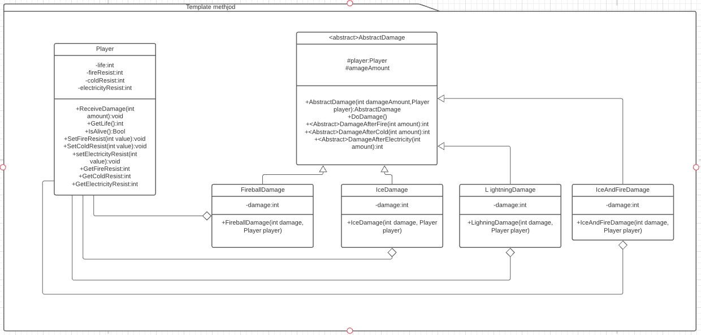

# Template method
Es un patrón de comportamiento. [Link de la descripción](https://sourcemaking.com/design_patterns/template_method)

El patrón template method permite delegar la implementación de uno o más métodos en subclases de un padre abstracto, dicho padre define un método que establecera el orden en que se llamen a los demás métodos y las subclases son las encargadas de definir la implementación de cada uno.

## Diagrama de clases

## SOLID

* Single responsability

Template method ayuda a tener clases con una sola responsabilidad permitiendo crear subclases que definan comportamiento en los métodos abstractos heredados para tener variedad de algoritmos distintos que atiendan un fin común.

* Open/Closed principle

Este principio no es ayudado por el template method ya que solo se puede escalar verticalmente entre los métodos abstractos heredados, si hace falta crear nuevos métodos o cambiar la relación entre ellos habra que modificar el funcionamiento de la clase abstracta padre.

* Liskov substitution

El principio de Liskov juega bien con template method ya que todas las implementaciones de la clase abstracta deben ser intercambiables entre sí.

* Interface segregation

Nos permite tener varias implementaciones de los algoritmos separadas en funcionalidad sin recurrir a una superclase llena de if/elses

* Dependency inversion

Este principio también juega bien con template method ya que siempre podemos referirnos a los algoritmos a traves de la superclase abstracta.